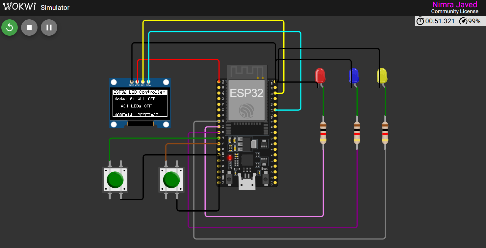
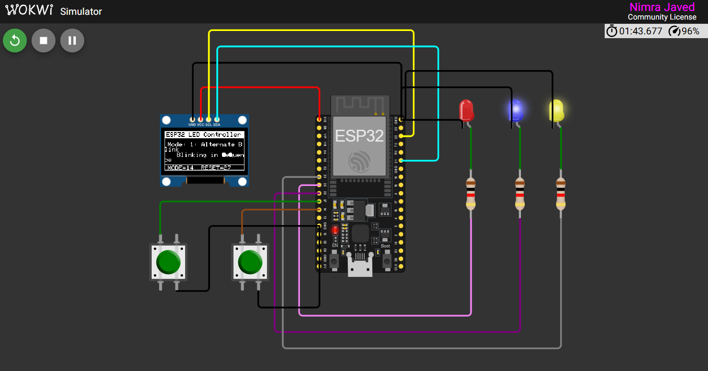
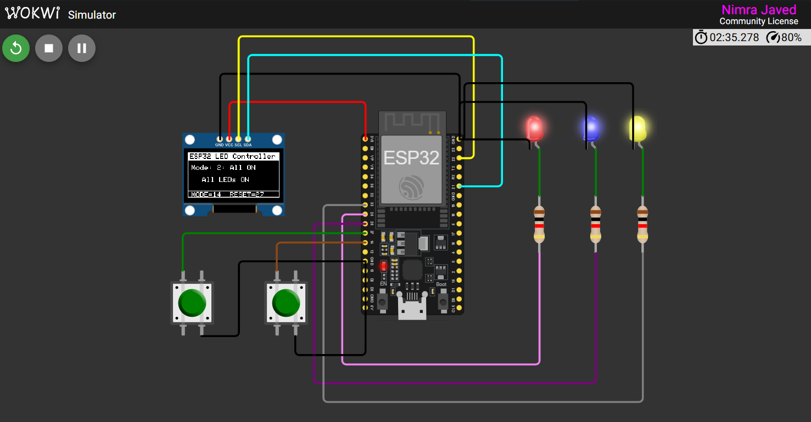
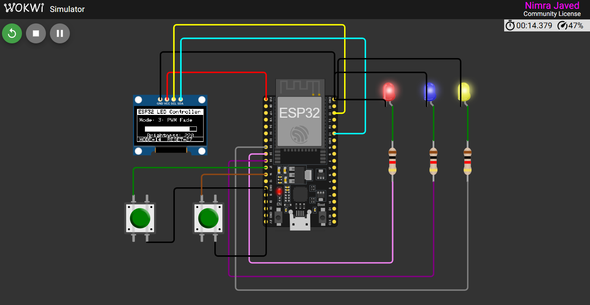
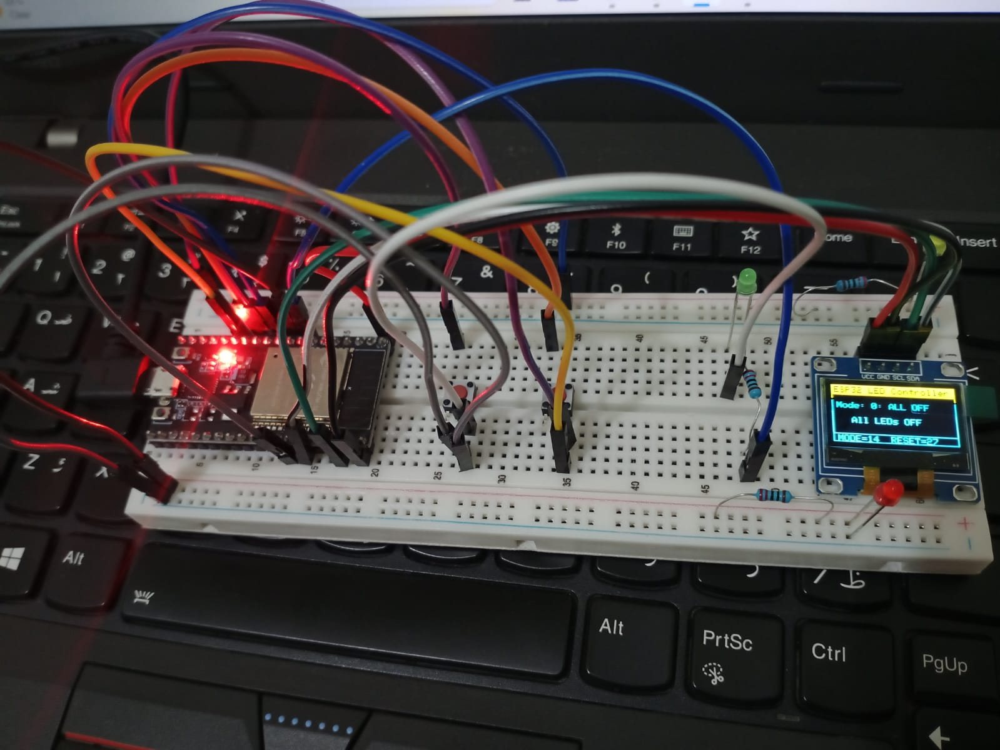

Name: Nimra Javed
Reg No: 23-NTU-CS-1082
Section: BS-CS_5th B
Board: ESP32
Title: LED Mode Controller with OLED Display

##  Project Description

Project Overview

Demonstrates multiple LED control modes using an ESP32.

Includes real-time status display on an OLED screen.

🔹 Input Controls

Push Button 1: Cycles through different LED modes.

Push Button 2: Resets the system to the default OFF mode.

🔹 OLED Display Features

Shows the current LED mode.

Displays header information and pin mapping for clarity.

🔹 LED Control

Each LED mode uses PWM channels for brightness control.

Enables smooth fading effects and variable intensity.

##  LED Modes

| Mode | Description                      |
|------|----------------------------------|
| 0    | All LEDs OFF                     |
| 1    | Alternate LED blinking sequence  |
| 2    | All LEDs ON                      |
| 3    | PWM Fade(Cross-fade between LEDs)|
 
##  Features

- Uses Adafruit SSD1306 OLED library for clear UI.  
- Includes PWM fade effect using hardware PWM channels of ESP32.  
- Debounced button input handling.  
- OLED UI Frame shows header, mode, and pin hints.  
- Works perfectly on Wokwi simulator and physical ESP32 board.

##  Wokwi Simulation Link

(https://wokwi.com/projects/445507758525483009)

## Pin Configuration (Pin Map)

| Component        | ESP32 Pin | Description                 |
|------------------|-----------|-----------------------------|
| LED 1            | GPIO 25   | Controlled by PWM Channel 0 |
| LED 2            | GPIO 26   | Controlled by PWM Channel 1 |
| LED 3            | GPIO 33   | Controlled by PWM Channel 2 |
| Button 1 (MODE)  | GPIO 14   | Changes LED mode            |
| Button 2 (RESET) | GPIO 27   | Resets to OFF mode          |
| OLED SDA         | GPIO 21   | I²C Data line               |
| OLED SCL         | GPIO 22   | I²C Clock line              |
| VCC              | 3.3V      | Power supply                |
| GND              | GND       | Ground                      |

##  Screenshots

### Mode 0 – All LEDs OFF

### Mode 1 – Alternate Blink

### Mode 2 – All LEDs ON

### Mode 3 – PWM Fade (with brightness bar on OLED)

## OLED display

